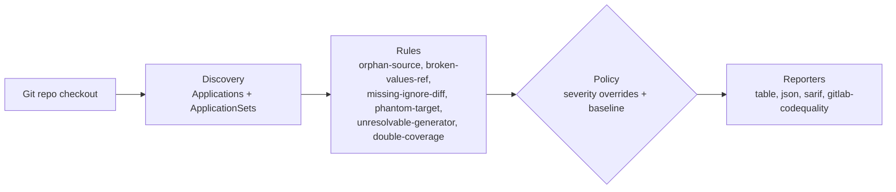

# argocd-source-lint

[](https://github.com/gillesl-dev/argocd-source-lint/actions/workflows/test.yml)
[](./LICENSE)
[](https://www.python.org/)
[](https://github.com/astral-sh/ruff)
[](#)

Static linter to detect silent failures in multi-source ArgoCD
`Application` resources: resources never synced, broken `$values`,
missing `ignoreDifferences`, phantom targets.

These are the failures ArgoCD itself stays quiet about: the Application
shows healthy and synced while a manifest sits in the repo unreferenced,
a `$ref` points nowhere, or two Applications fight over the same file.
`argocd-source-lint` analyzes the Git repo it runs in (the checkout
already present in CI) — no cluster access, no `kubeconfig`, no
sensitive data involved.

## Contents

- [What the tool does](#what-the-tool-does)
- [How it fits together](#how-it-fits-together)
- [What the tool does not do (v1)](#what-the-tool-does-not-do-v1)
- [Installation](#installation)
- [Usage](#usage)
- [Configuration](#configuration)
- [Adopting on an existing repo](#adopting-on-an-existing-repo)
- [CI/CD integration](#cicd-integration)
- [Development](#development)
- [License](#license)

## What the tool does

| Rule | Default severity | Detects |
| --- | --- | --- |
| `orphan-source` | error | a manifest present in the repo but not covered by any declared source |
| `broken-values-ref` | error | a `$ref` in a Helm `valueFiles` entry with no matching source or file |
| `missing-ignore-diff` | warning | a known at-risk CRD (CNPG, cert-manager...) with no `ignoreDifferences` while `selfHeal: true` is active |
| `phantom-target` | error | a `targetRevision`/`path` that resolves to nothing in the repo |
| `unresolvable-generator` | info | an `ApplicationSet` generator this tool can't resolve from a local checkout alone (live cluster/API access, or `goTemplate: true` rendering) |
| `double-coverage` | error | a file covered by more than one *different* Application at once, each syncing it from an independent loop |

Sample run, table output (the default):

```text
$ argocd-source-lint .

  Rule                Severity  File                                Application     Message
 ──────────────────────────────────────────────────────────────────────────────────────────────────────────────
  phantom-target       error    apps/payments/application.yaml     payments-service  targetRevision "release-3.2"
                                                                                       does not resolve to any
                                                                                       local ref
  orphan-source        error    manifests/legacy/old-ingress.yaml   -                 not covered by any
                                                                                       declared source
  double-coverage      error    manifests/shared/configmap.yaml    -                 covered by both "team-a"
                                                                                       and "team-b"
  missing-ignore-diff  warning  apps/postgres/application.yaml     postgres-cluster  selfHeal: true with no
                                                                                       ignoreDifferences on a
                                                                                       CNPG Cluster

4 findings (2 error, 1 warning, 0 info) — exit code 1
```

## How it fits together



Everything left of the policy step is pure filesystem/git reading — no
network call, no credential, so it runs in any CI job that already has a
checkout. Each rule is listed in full in the [table above](#what-the-tool-does).

## What the tool does not do (v1)

- No cluster access.
- No Kustomize *rendering* (bases merged, patches applied) — delegate to
  `kustomize build`/a dedicated linter for that. `orphan-source` does
  read `kustomization.yaml`'s `resources`/`bases`/`components`/`patches`/
  generators to know which files in the overlay are actually referenced,
  the same signal as a plain directory source (see DESIGN.md); a remote
  resource reference is silently skipped, not guessed at.
- `ApplicationSet` support covers `list`, `git` (`directories`/`files`),
  `matrix` and `merge` generators — each generated `Application` goes
  through the same rules as a plain one. `clusters`/`scmProvider`/
  `pullRequest`/`plugin` generators, `goTemplate: true` rendering, and a
  generator's own `selector` (label filter) require live cluster/API
  access or logic this tool doesn't reimplement — out of scope v1,
  flagged `unresolvable-generator` rather than guessed at.
- Multi-repo `Application` resources (sources pointing to a repo other
  than the one analyzed) are detected and flagged `info`, never checked
  nor silently ignored.

## Installation

```bash
pip install argocd-source-lint
```

> Currently published to TestPyPI only, pending v1.0.0 (see
> [Development](#development) for the TestPyPI install command). The
> [GitHub Action](#github-actions) and [pre-commit hook](#pre-commit)
> below will start working end-to-end once the package lands on the
> real PyPI index.

## Usage

```bash
# From the root of the repo to analyze
argocd-source-lint .

# Output formats: table (default), json, sarif, gitlab-codequality
argocd-source-lint . --format sarif --output results.sarif
```

Exit code: `0` if no blocking finding, `1` otherwise. An `error` finding
always blocks; an `unverifiable` one (e.g. a Git revision not locally
resolvable — incomplete shallow clone) blocks by default, configurable via
`unverifiable_blocks_ci`.

## Configuration

Copy [`.argocd-lint.example.yaml`](./.argocd-lint.example.yaml) to
`.argocd-lint.yaml` at the root of the repo to analyze. Any omitted key
keeps its default value:

```yaml
scan_roots:
  - manifests/
  - infra/

rules:
  orphan-source: error
  broken-values-ref: error
  missing-ignore-diff: warning
  phantom-target: error
  unresolvable-generator: info
  double-coverage: error

unverifiable_blocks_ci: true

exclude_paths:
  - manifests/legacy/**

# Additional operator signatures, on top of the built-in pack
# (CNPG, cert-manager) — never a replacement.
known_operators:
  - crd_trigger: my-operator.io/MyCRD
    name_from: metadata.name
    expect_ignore_on:
      - kind: Secret
        name_pattern: "{name}-credentials"
```

## Adopting on an existing repo

A first run on a large, existing repo will likely surface pre-existing
issues (a decommissioned component never archived, a manifest applied
out-of-band). Accept them once so only *new* findings block CI from now
on:

```bash
argocd-source-lint . --write-baseline
```

This writes `.argocd-lint-baseline.yaml` — commit it. It's plain YAML
(rule, file, application, message), meant to be reviewed like any other
file, not a hash lockfile. Re-run `--write-baseline` any time you want to
accept the current state again (it overwrites the file outright).

## CI/CD integration

### GitHub Actions

```yaml
- uses: gillesl-dev/argocd-source-lint@v0.1.9
  with:
    path: .
```

### GitLab CI

```yaml
include:
  - component: $CI_SERVER_FQDN/<namespace>/argocd-source-lint/lint@v0.1.9
    inputs:
      scope: manifests/
```

### pre-commit

```yaml
repos:
  - repo: https://github.com/gillesl-dev/argocd-source-lint
    rev: v0.1.9
    hooks:
      - id: argocd-source-lint
```

## Development

```bash
uv sync --extra dev
uv run argocd-source-lint .
uv run pytest
```

To try a TestPyPI-published version locally instead of the extra
dependencies above:

```bash
pip install --index-url https://test.pypi.org/simple/ \
  --extra-index-url https://pypi.org/simple/ \
  argocd-source-lint
```

See [DESIGN.md](./DESIGN.md) for the reasoning behind the mono-repo v1
scope, the `directory.recurse`/`include`/`exclude` semantics, and other
non-obvious decisions, and [CONTRIBUTING.md](./CONTRIBUTING.md) to add a
rule or an operator signature.

## License

MIT — see [LICENSE](./LICENSE).
