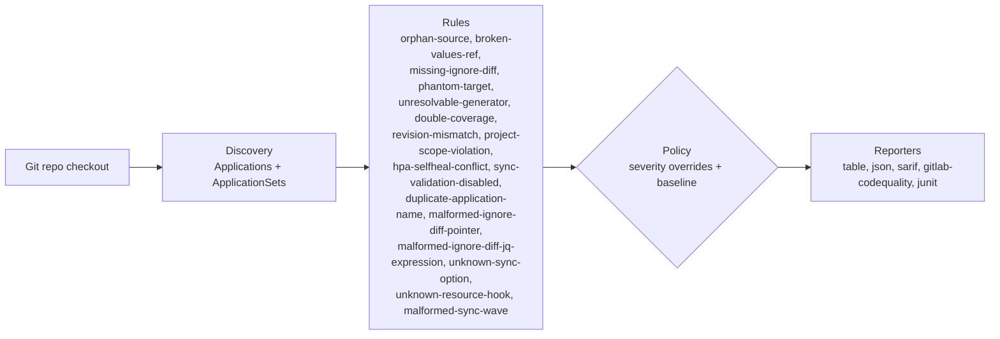

# argocd-source-lint

[](https://github.com/gillesl-dev/argocd-source-lint/actions/workflows/test.yml)
[](./LICENSE)
[](https://www.python.org/)
[](https://github.com/astral-sh/ruff)
[](#)

Static linter for detecting silent failures in multi-source ArgoCD `Application` resources.

It catches cases that are easy to miss because ArgoCD may still report an Application as healthy and synced: manifests that are never referenced, broken `$values` references, missing `ignoreDifferences`, invalid targets, conflicting Applications, and similar configuration issues.

`argocd-source-lint` works from the Git checkout already available in CI. It doesn't connect to the Kubernetes cluster and does not require a `kubeconfig` or cluster credentials.

## Contents

- [What the tool does](#what-the-tool-does)
- [How it works](#how-it-works)
- [Limitations](#limitations)
- [Installation](#installation)
- [Usage](#usage)
- [Configuration](#configuration)
- [Using it on an existing repository](#using-it-on-an-existing-repository)
- [CI/CD integration](#cicd-integration)
- [Development](#development)
- [Changelog](./CHANGELOG.md)
- [Security policy](./SECURITY.md)
- [License](#license)

## What the tool does

| Rule | Default severity | Detects |
| --- | --- | --- |
| `orphan-source` | error | A manifest present in the repository but not covered by any declared source |
| `broken-values-ref` | error | A Helm `valueFiles` entry, including `$ref`, that points to a file that doesn't exist |
| `missing-ignore-diff` | warning | A known at-risk CRD with `selfHeal: true` but no matching `ignoreDifferences` configuration |
| `phantom-target` | error | A `targetRevision` or `path` that resolves to nothing in the repository |
| `unresolvable-generator` | info | An `ApplicationSet` generator that can't be resolved from the local checkout alone |
| `double-coverage` | error | A file covered by more than one different Application, with each Application syncing it independently |
| `revision-mismatch` | info | A source whose `targetRevision` differs from the checked-out revision |
| `project-scope-violation` | error | An Application source or destination outside the `sourceRepos` or `destinations` allowed by its `AppProject` |
| `hpa-selfheal-conflict` | warning | An HPA and ArgoCD `selfHeal` both managing `spec.replicas` without the required ignore configuration |
| `sync-validation-disabled` | info | The `Validate=false` sync option, which allows an invalid manifest to be applied |
| `duplicate-application-name` | error | Two or more Applications using the same namespace and name |
| `malformed-ignore-diff-pointer` | warning | An `ignoreDifferences.jsonPointers` entry that doesn't start with `/` as required by RFC 6901 |
| `malformed-ignore-diff-jq-expression` | warning | An `ignoreDifferences.jqPathExpressions` entry that doesn't start with `.` and fails to compile as jq |
| `unknown-sync-option` | warning | An unknown or incorrectly cased ArgoCD sync option |
| `unknown-resource-hook` | warning | An unknown ArgoCD hook or hook deletion policy value |
| `malformed-sync-wave` | warning | A sync-wave annotation whose value isn't a valid integer |

### A few examples

`duplicate-application-name` catches two Applications using the same namespace and name. ArgoCD identifies an Application by that pair, so duplicates can end up competing for the same object.

With `hpa-selfheal-conflict`, the problem is `spec.replicas`. If an HPA owns it while ArgoCD self-heal is enabled, ArgoCD can keep restoring the configured replica count. The rule checks for both `ignoreDifferences` and the `RespectIgnoreDifferences` sync option.

A malformed JSON pointer is easier to miss than it looks. Entries under `ignoreDifferences.jsonPointers` have to start with `/`.

`malformed-ignore-diff-jq-expression` checks the other form of ignore rule. A malformed jq expression can invalidate the `ignoreDifferences` configuration for that Application.

Sync options are case-sensitive. Something that looks close enough can still be ignored by ArgoCD, which is what `unknown-sync-option` looks for.

For sync waves, the annotation value has to be an integer. An invalid value falls back to wave `0`.

Sample run using the default table output:

```text
$ argocd-source-lint .

Rule                 Severity  File                                 Application       Message
────────────────────────────────────────────────────────────────────────────────────────────────
phantom-target       error     apps/payments/application.yaml       payments-service  targetRevision "release-3.2"
                                                                                     does not resolve to any
                                                                                     local ref
orphan-source        error     manifests/legacy/old-ingress.yaml    -                 not covered by any
                                                                                     declared source
double-coverage      error     manifests/shared/configmap.yaml      -                 covered by both "team-a"
                                                                                     and "team-b"
missing-ignore-diff  warning   apps/postgres/application.yaml       postgres-cluster  selfHeal: true with no
                                                                                     ignoreDifferences on a
                                                                                     CNPG Cluster

4 findings (3 error, 1 warning, 0 info) — exit code 1
```

## How it works



Discovery and rule evaluation only read the filesystem and the local Git repository. There are no network calls and no cluster credentials are required.

That makes the linter suitable for a normal CI job as long as the repository has already been checked out.

## Limitations

### Kubernetes cluster

The linter works from the repository checkout and doesn't query the Kubernetes cluster. Checks that require live cluster state aren't covered.

### Kustomize

Kustomize overlays aren't rendered. If you need to validate the rendered result, run `kustomize build` or a dedicated Kustomize validation tool separately.

`orphan-source` does inspect `kustomization.yaml`, though. It follows local references from:

- `resources`
- `bases`
- `components`
- `crds`
- `patches`
- generators

This keeps referenced files in an overlay from being reported as orphans.

Remote Kustomize resources are skipped because they cannot be verified from the local checkout.

See [DESIGN.md](./DESIGN.md) for more details.

### ApplicationSet

The following generators can be resolved locally:

- `list`
- `git` with `directories`
- `git` with `files`
- `matrix`
- `merge`

Applications produced from them go through the same rules as regular `Application` resources.

Some generators need information that is not available from a checkout alone. This includes:

- `clusters`
- `scmProvider`
- `pullRequest`
- `plugin`
- `goTemplate: true`
- generator-level `selector` filtering

Those cases are reported as `unresolvable-generator`.

### Multi-repository Applications

If an Application points to another Git repository, the linter cannot inspect that repository from the current checkout.

The source is still detected and reported as `info`.

## Installation

```bash
pip install argocd-source-lint
```

## Usage

Run the linter from the root of the repository:

```bash
argocd-source-lint .
```

Available output formats are:

```text
table
json
sarif
gitlab-codequality
junit
```

For example:

```bash
argocd-source-lint . --format sarif --output results.sarif
```

### Exit codes

The command returns:

- `0` when there is no blocking finding
- `1` when at least one blocking finding is present

An `error` always blocks CI.

An `unverifiable` result also blocks by default. This can happen when a Git revision can't be resolved locally, for example with an incomplete shallow clone.

You can change that behavior with:

```yaml
unverifiable_blocks_ci: false
```

## Configuration

Copy [`.argocd-lint.example.yaml`](./.argocd-lint.example.yaml) to `.argocd-lint.yaml` at the root of the repository.

Any setting you leave out keeps its default value.

```yaml
scan_roots:
  - manifests/
  - infra/

rules:
  orphan-source: error
  broken-values-ref: error
  missing-ignore-diff: warning
  phantom-target: error
  unresolvable-generator: info
  double-coverage: error
  revision-mismatch: info
  project-scope-violation: error
  hpa-selfheal-conflict: warning
  sync-validation-disabled: info
  duplicate-application-name: error
  malformed-ignore-diff-pointer: warning
  malformed-ignore-diff-jq-expression: warning
  unknown-sync-option: warning
  unknown-resource-hook: warning
  malformed-sync-wave: warning

unverifiable_blocks_ci: true

exclude_paths:
  - manifests/legacy/**

# Additional operator signatures.
# These are added to the built-in signatures for:
# CNPG, cert-manager, Elastic ECK, RabbitMQ, Strimzi,
# Zalando Postgres Operator, Keycloak Operator and
# External Secrets Operator.
known_operators:
  - crd_trigger: my-operator.io/MyCRD
    name_from: metadata.name
    expect_ignore_on:
      - kind: Secret
        name_pattern: "{name}-credentials"
```

Custom `known_operators` entries extend the built-in operator list. They don't replace it.

## Using it on an existing repository

Running the linter for the first time on an established repository may uncover findings you don't want to fix immediately.

For example, there may be a leftover manifest from a decommissioned component or files that are deliberately deployed through another process.

You can record the current state as a baseline:

```bash
argocd-source-lint . --write-baseline
```

This creates:

```text
.argocd-lint-baseline.yaml
```

Commit the file with the repository. Later runs will still report new findings, while entries already recorded in the baseline are accepted.

The baseline is plain YAML, so it's easy to review or edit when needed.

Running `--write-baseline` again replaces the existing baseline with the current findings.

## CI/CD integration

### GitHub Actions

The action publishes its SARIF report through `github/codeql-action/upload-sarif`.

That upload needs permissions on the calling job:

```yaml
jobs:
  lint:
    runs-on: ubuntu-latest

    permissions:
      security-events: write
      actions: read
      contents: read

    steps:
      - uses: actions/checkout@v4

      - uses: gillesl-dev/argocd-source-lint@v1.0.2
        with:
          path: .
```

`actions: read` and `contents: read` are needed for private repositories.

### GitLab CI

GitLab components have to be hosted on the same GitLab instance as the project using them.

`argocd-source-lint` is hosted on GitHub. Start by copying [`templates/lint.yml`](./templates/lint.yml) into a project on your GitLab instance.

You'll also need a `README.md` at the root of that project for GitLab's component layout.

Then include the component using a tag, branch, or commit SHA:

```yaml
include:
  - component: $CI_SERVER_FQDN/<your-gitlab-group>/argocd-source-lint/lint@v1.0.2
    inputs:
      scope: manifests/
```

You don't have to publish the component in the GitLab CI/CD Catalog. A normal `include:` works without Catalog publication.

### pre-commit

```yaml
repos:
  - repo: https://github.com/gillesl-dev/argocd-source-lint
    rev: v1.0.2
    hooks:
      - id: argocd-source-lint
```

## Development

Install the project and development dependencies:

```bash
uv sync --extra dev
```

Run the linter locally:

```bash
uv run argocd-source-lint .
```

Run the tests:

```bash
uv run pytest
```

To try a version published on TestPyPI:

```bash
pip install \
  --index-url https://test.pypi.org/simple/ \
  --extra-index-url https://pypi.org/simple/ \
  argocd-source-lint
```

For implementation details, see [DESIGN.md](./DESIGN.md).

To add a rule or operator signature, see [CONTRIBUTING.md](./CONTRIBUTING.md).

Version history is available in [CHANGELOG.md](./CHANGELOG.md).

## License

MIT. See [LICENSE](./LICENSE).
